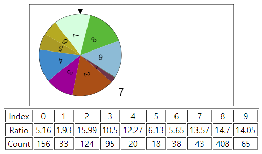

# RandomWheelIsWeird
I think random wheel has a problem. but I don't know what it is. This is the test for random wheel

As you can see, those counts are not similar with ratios.. why? I don't know.
I hope someone solve this problem.

And..
The jame.js is private project. as soon as I will make it public. so you can use it as free.
But it is beta version. and there is no description for it.
I think it is better to wait until it is public.
